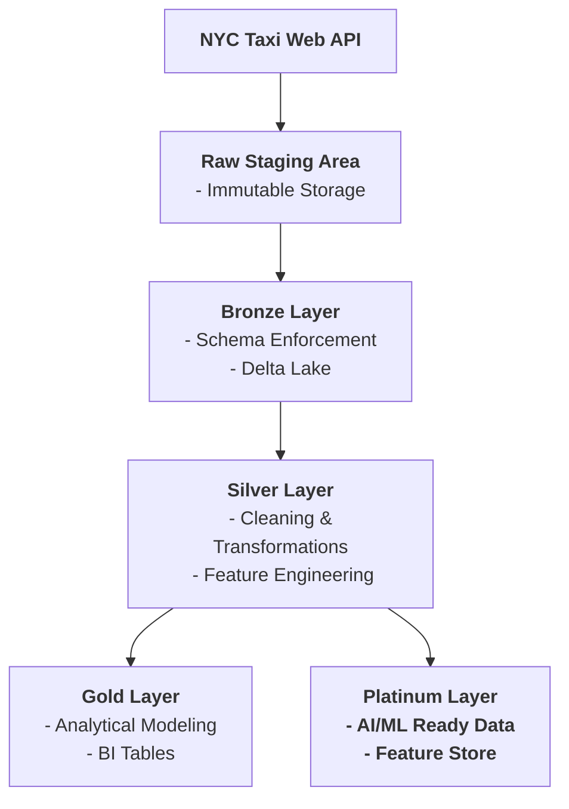

# Extended Medallion Architecture (Lakehouse ETL)

This project ingests and processes NYC taxi trip data through layered transformations that progressively enforce schema validation, data quality checks, and business-driven logic. Designed with production-oriented principles such as idempotent transformations, clear layer isolation, and analytics-ready structuring, the pipeline establishes a reliable foundation for downstream business intelligence and future machine learning workloads.

---

## Architecture

---

## Implemented Layers

### 🔹 Raw Layer
- Immutable ingestion from external sources (NYC TLC green taxi data)
- Partitioned by year
- No transformations applied
- Acts as the system of record

### 🔹 Bronze Layer
- Schema enforcement
- Data type standardization
- Basic validation checks
- Minimal transformation while preserving source granularity

### 🔹 Silver Layer
- Business-rule filtering
- Deduplication
- Feature engineering (e.g., trip duration, fare per mile)
- Join-ready, analytics-optimized datasets

---

## Upcoming Layers

### 🔸 Gold Layer (Planned)
- Aggregated business metrics
- Star-schema dimensional modeling
- Dashboard-ready fact and dimension tables

### 🔸 Platinum Layer (Planned)
- Machine learning feature engineering
- Vector embeddings
- Model training datasets

---

## Project Structure
```
extended-medallion-architecture/
|-- etl_notebooks/
|   |-- ingestion_to_raw.ipynb
|   |-- raw_to_bronze.ipynb
|   |-- bronze_to_silver.ipynb
|   |-- silver_to_gold.ipynb
|   |-- silver_to_platinum.ipynb
|
|-- storage_raw/
|   |--trip_data/
|   |--trip_type/
|   |   |--trip_type.csv
|   |--trip_zone/
|   |   |--taxi_zone_lookup.csv
|-- storage_bronze/
|-- storage_silver/
|-- storage_gold/
|-- storage_platinum/
```
---

## Tech Stack

- Apache Spark 3.5+
- Delta Lake
- Python 3.10+
- Jupyter / Databricks

---

## Key Engineering Focus

- Deterministic, idempotent transformations
- Business-driven data validation
- Layer isolation (no cross-layer mutation)
- Scalable Spark processing
- Cost-aware iterative development

---

## Status

✅ Raw → Bronze → Silver implemented  
🚧 Gold and Platinum layers in progress  

---

## Purpose

This project demonstrates:

- End-to-end data engineering pipeline design  
- Proper Medallion architecture implementation  
- Structured data quality enforcement  
- Lakehouse best practices using Spark and Delta Lake  
