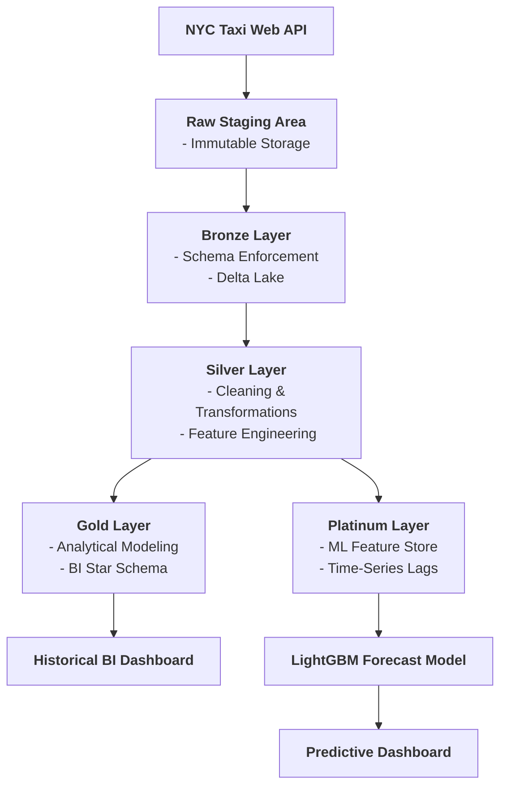

# Extended Medallion Architecture with Platinum Layer for AI/ML Readiness

This capstone project builds an end-to-end batch data pipeline that transforms raw NYC Taxi data into both actionable business intelligence and predictive machine learning models. 

While traditional data engineering pipelines stop at historical reporting, this project implements an **"Extended Medallion Architecture"** featuring a novel **Platinum Layer**. This layer acts as a dedicated Machine Learning feature store, transforming cleaned data into complex time-series features to power a LightGBM model that forecasts 90-day taxi demand. The result is a unified architecture that serves both the CFO looking at past revenue and the Operations Manager planning future driver capacity.

---

## Architecture

```mermaid
flowchart TD

    A[<b>NYC Taxi Web API</b>] --> B[<b>Raw Staging Area</b><br/> - Immutable Storage]
    
    B --> C[<b>Bronze Layer</b><br/> - Schema Enforcement<br/> - Delta Lake]
    
    C --> D[<b>Silver Layer</b><br/> - Cleaning & Transformations<br/> - Feature Engineering]
    
    D --> E[<b>Gold Layer</b><br/> - Analytical Modeling<br/> - BI Star Schema]
    
    D --> F[<b>Platinum Layer</b><br/> - ML Feature Store<br/> - Time-Series Lags]

    E --> G[<b>Historical BI Dashboard</b>]
    F --> H[<b>LightGBM Forecast Model</b>] --> I[<b>Predictive Dashboard</b>]
```
---

## Implemented Layers

### 🔹 Raw Layer
- Immutable ingestion from external sources (NYC TLC yellow taxi data).
- Partitioned by year.
- Acts as the system of record with no transformations applied.

### 🔹 Bronze Layer
- Schema enforcement and data type standardization.
- Quarantine path for bad/malformed data.
- Delta Lake format for ACID transactions and robust table management.

### 🔹 Silver Layer
- Business-rule filtering and deduplication.
- Feature engineering (trip duration, fare per mile, time-based fields).
- Join-ready, analytics-optimized datasets.

### 🔹 Gold Layer (Descriptive Analytics)
- **Dimensional Modeling** with a strict star-schema design.
- **Dimension Tables:** `dim_vendor`, `dim_rate_code`, `dim_payment_type`, `dim_store_forward_flag`, `dim_location`.
- **Fact Tables:** Highly aggregated summaries (`fact_trip_yearly_summary`, `fact_payment_summary`, `fact_location_summary`, `fact_distance_summary`, `fact_trip_time_summary`, `fact_vendor_summary`).
- Built specifically to serve traditional Business Intelligence (BI) workloads.

### 🔸 Platinum Layer (Predictive Analytics & ML)
- A specialized layer acting as an ML Feature Store.
- Generates complex, time-bound autoregressive features (e.g., `lag_1h`, `lag_24h`, `lag_168h`) and rolling averages at a strict hour-by-hour granularity.
- Isolates machine learning workloads from general BI reporting.

---

## Products & Applications

The pipeline powers two distinct data products serving different business personas:

### 1. NYC Taxi Analytics Dashboard (The "Gold" Product)
**Location:** `products/historical_demand/historical_dashboard.py`

A Streamlit-based BI dashboard built for executive reporting and descriptive analytics ("What happened?").
- **KPIs & Revenue Trends:** Year-over-year revenue, total trips, and average trip values.
- **Behavioral Analysis:** Payment type distributions and vendor performance.
- **Location Intelligence:** Top pickup zones by revenue and borough comparisons.

### 2. Demand Intelligence & Capacity Planning (The "Platinum" Product)
**Location:** `products/forecasting_demand/forecast_dashboard.py`

A Streamlit-based operational dashboard built for fleet management and future capacity planning ("What will happen?").
- **LightGBM Forecasting:** Integrates a trained LightGBM regression model to project taxi demand 90 days into the future.
- **Seasonal Baselines:** Visualizes the specific hour-of-day and day-of-week patterns the model uses to make predictions.
- **Driver Requirement Estimator:** Translates pure trip forecasts into actionable staffing requirements based on user-defined utilization rates.

*(Note: Model evaluation metrics can be viewed via `products/forecasting_demand/model/model_evaluation_dashboard.py`)*

---

## Project Structure
```text
extended-medallion-architecture/
|-- 00_storage_raw/
|-- 01_storage_bronze/
|-- 02_storage_silver/
|-- 03_storage_gold/
|-- 04_storage_platinum/
|-- etl_notebooks/
|   |-- 00_ingestion_to_raw.ipynb
|   |-- 01_raw_to_bronze.ipynb
|   |-- 02_bronze_to_silver.ipynb
|   |-- 03_silver_to_gold.ipynb
|   |-- 04_silver_to_platinum.ipynb
|-- products/
|   |-- historical_demand/
|   |   |-- historical_dashboard.py
|   |-- forecasting_demand/
|       |-- demand_forecast_model_training.ipynb
|       |-- forecast_dashboard.py
|       |-- model/
|           |-- model_evaluation_dashboard.py
```
---

## Tech Stack
- **Data Processing & Storage:** PySpark, Delta Lake (ACID transactions, time travel, schema evolution).
- **Machine Learning:** LightGBM, Scikit-learn.
- **Data Analysis:** Pandas, NumPy.
- **Visualization & UI:** Streamlit, Plotly, Matplotlib.

---

## Key Engineering Focus
- **Separation of Concerns:** Clear isolation between BI reporting (Gold) and ML feature engineering (Platinum).
- **Scale:** PySpark memory optimization and shuffle tuning (`spark.sql.adaptive.enabled`) for large-scale batch processing.
- **Reliability:** Deterministic, idempotent transformations with Bronze-layer quarantine routing for data quality assurance.

---